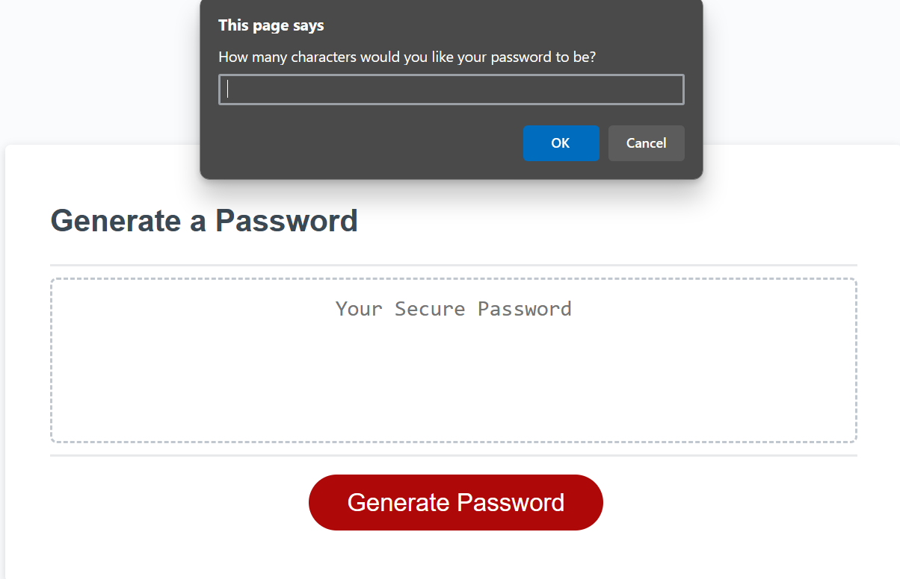
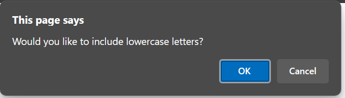

# 🔑password-generator
This is the Password Generator, Challenge #03

## Description

This project is a JavaScript-based password generator. Users can customize the password length and choose whether to include uppercase letters, lowercase letters, numbers, and special characters. The tool provides robust and secure passwords tailored to individual preferences.

## Features

1. Customizable password length.
2. Options to include uppercase, lowercase, numbers, and special characters.
3. User-friendly interface.

## Table of Contents

- [Credits](#credits)
- [License](#license)
- [Website-Appearance](#website)

## Credits

N/A

## License

Please refer to the LICENSE in the repo.

## Website

Link to the live application: 
The following image shows the web application's appearance and functionality:

## Badges

## Thanks for stopping here!.
